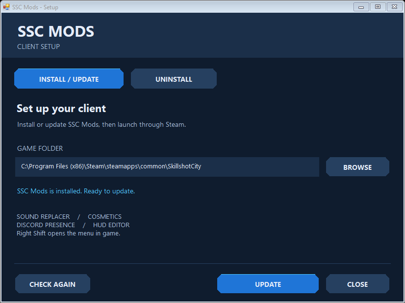

# SSC Mod Client

An unofficial Windows client-side mod for Skillshot City.

## Install

Download **SSCMods-Setup.exe** from [Releases](https://github.com/Epiano7/SSC-Mod-Client/releases), close the game, and select its Steam folder. The same installer offers **Install / Update** and **Uninstall**. Launch through Steam and press **Right Shift** to open the menu.

## Modules

- **Sound Replacer:** import PCM WAV replacements, match volume and restore originals. Restart to apply. Replacement files must match the original sample rate and channel count.
- **Cosmetics:** local animated rainbow-name styling using the native palette and verified local account identity.
- **Discord Presence:** game status, available round/level details, elapsed time and ranked SSC rating. Uses the bundled Discord application; no user token is needed.
- **HUD Editor:** reposition and resize nine HUD groups, with saved layouts, resets and 25–600% scaling. Groups include minimap, version/FPS, timer, round/players, money/syringes, weapons/ammo, health/skills, team roster and event feed.

## Beta compatibility

Version **0.1.0-beta.1** targets one Windows x64 executable revision. Game updates may require a new mod build..

The HUD editor is experimental: automated geometry, input and fade-coordinate tests passed, but live dragging/resizing and relocated hover-fade behavior still need visual verification. In-app update checking is not implemented yet.

The installer leaves the game executable and assets unchanged. Uninstall preserves modified files and saved mod preferences.

[Build instructions](docs/build.md) · [Contributing](CONTRIBUTING.md) · [Installer details](installer/README.md)
