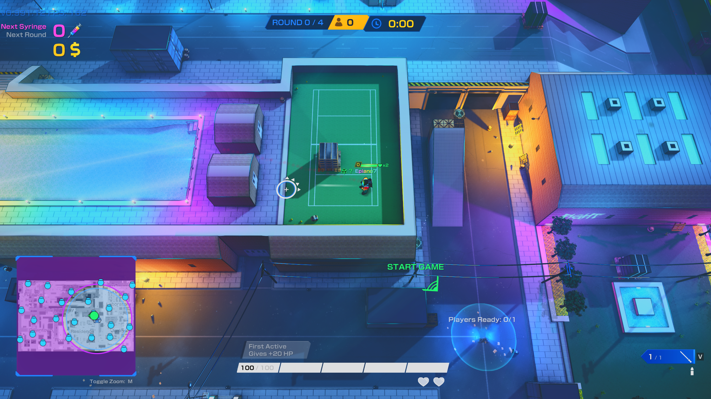
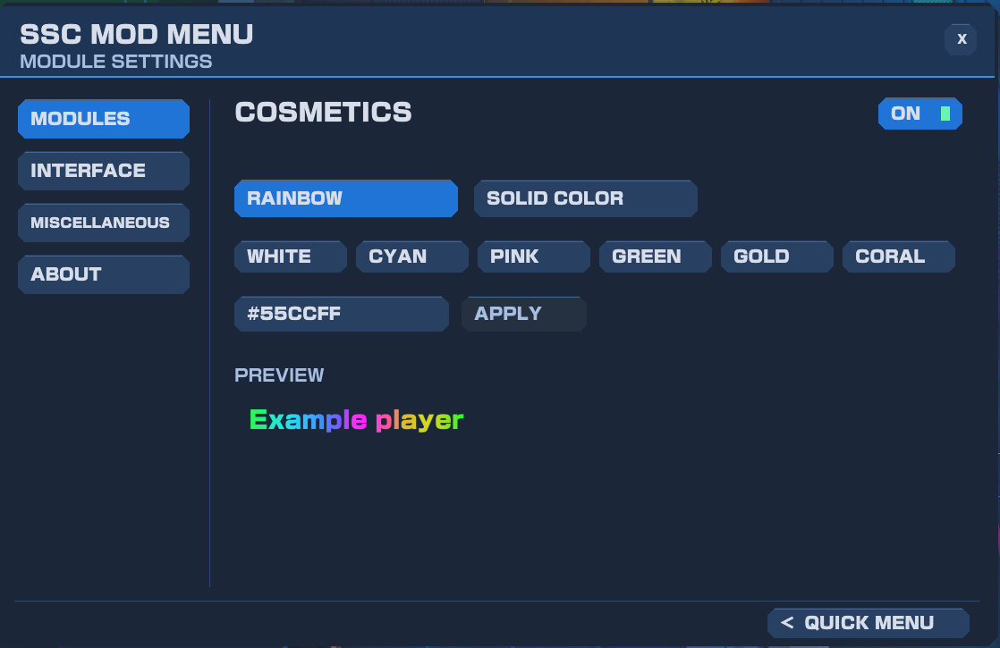
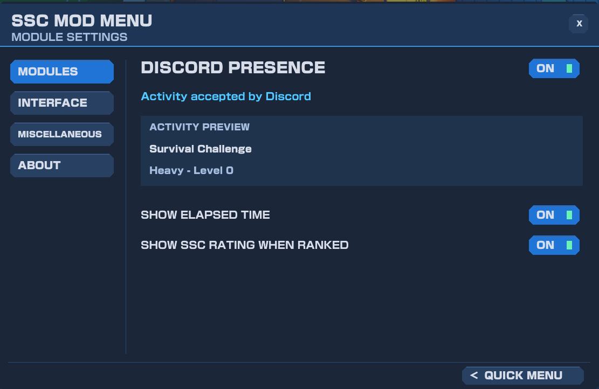

# SSC Mod Menu

An unofficial Windows client-side mod for Skillshot City.

## Download

[Download SSC Mod Menu for Windows](https://github.com/Epiano7/SSC-Mod-Menu/releases/latest/download/SSC-Mod-Menu-Setup.exe)

Run the installer and select your Skillshot City Steam folder. After installation, launch through Steam and press **Right Shift** to open the mod menu.

## Current Official Modules

- **Sound Replacer:** import WAV or MP3 replacements, match volume and restore originals. Sample rate and mono/stereo conversion are automatic. Requires a restart to apply. MP3 decoding uses Windows Media Foundation.
- **Cosmetics:** Customize your name with animated rainbow colors or a solid color, visible only to you.
- **Discord Presence:** game status, available round/level details, elapsed time and ranked SSC rating. No developer setup or token is required.
- **HUD Editor:** reposition and resize nine HUD groups, with saved layouts, resets and 25-600% scaling. Groups include minimap, version/FPS, round clock, round/players, money/syringes, weapons/ammo, healthbar/survival hearts/skills, team roster and event feed.

## Screenshots

A custom HUD layout in game:

Cosmetics and Discord Presence settings

## Compatibility

Installs into your Skillshot City Steam folder. Game updates may require a newer mod version.

## Credits
- bencelot (dev of SSC) for giving feedback before this released and for making the game ofc
- everyone in the SSC discord that provided feedback regarding early module dev, thank you!

[Build instructions](docs/build.md) | [Contributing](CONTRIBUTING.md) | [Installer details](installer/README.md)
