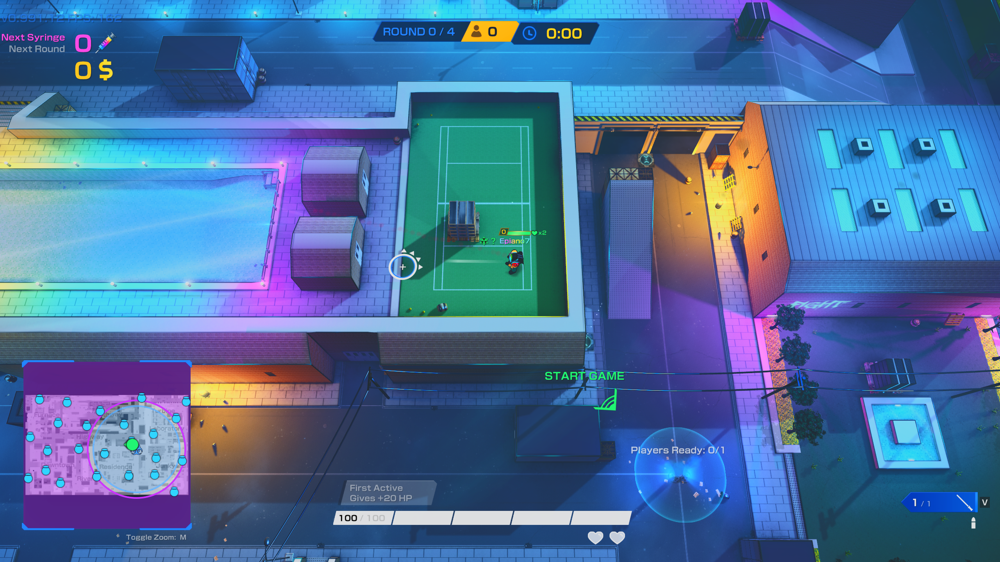
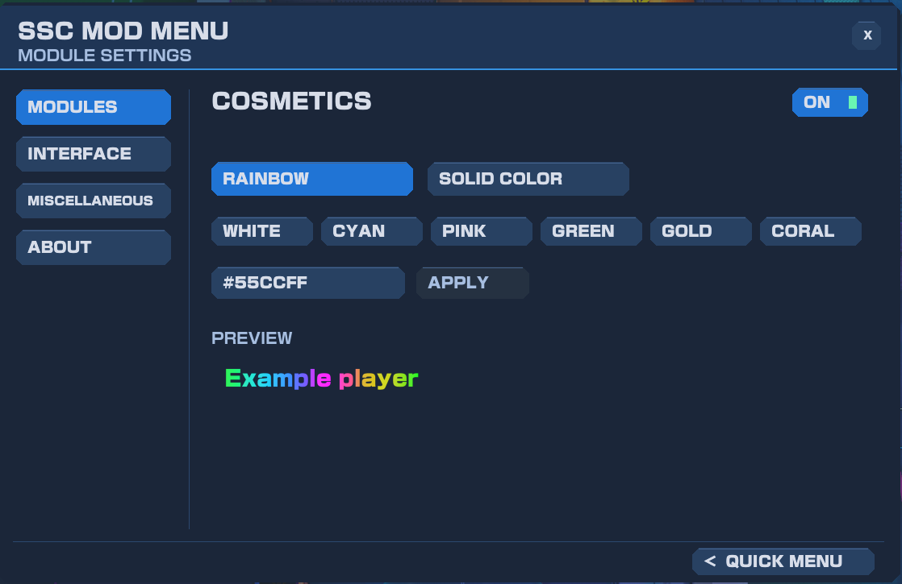
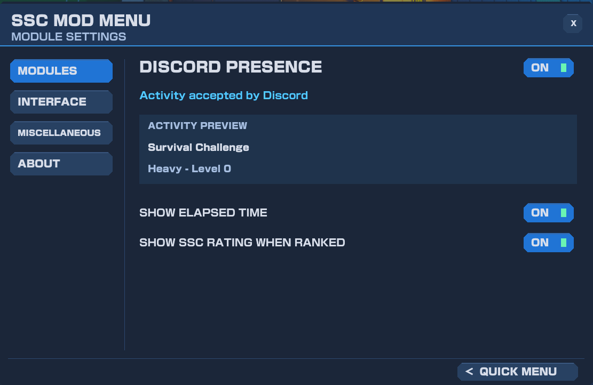

# SSC Mod Menu

An unofficial client-side mod for Skillshot City, with a Windows installer and an experimental Linux installer for Steam Proton.

## Download

[Download SSC Mod Menu for Windows](https://github.com/Epiano7/SSC-Mod-Menu/releases/latest/download/SSC-Mod-Menu-Setup.exe)

Run the installer and select your Skillshot City Steam folder. After installation, launch through Steam and press **Right Shift** to open the mod menu.

## Linux / Proton (experimental)

[Download SSC Mod Menu for Linux](https://github.com/Epiano7/SSC-Mod-Menu/releases/latest/download/SSC-Mod-Menu-Linux.tar.gz)

**Installation has been confirmed on Arch Linux with regular Steam and Proton Experimental. Most mod features are still untested on Linux.** Other distributions, Flatpak Steam, and in-game updating have not been verified

In **Skillshot City → Properties → Compatibility**, enable **Force the use of a specific Steam Play compatibility tool** and choose **Proton Experimental**. Let Steam download the Windows build and launch it once, then close the game and fully exit Steam

Extract the download, open **SSC-Mod-Menu-Setup**, select the folder containing **SkillshotCity.exe**, and click **Install / Update**. Reopen Steam and launch the game

The installer runs natively; the game and mod use Proton. The native Linux game is not supported yet. No separate Wine setup is needed. If the setup file does not open, allow executing it as a program in its file Properties

[Full Linux instructions and log export](linux/README.md)

## Modules

- **Sound Replacer:** import WAV or MP3 replacements for sound effects and music, preview clips, adjust individual volume, and replace related variants together. **All Music Tracks** uses one custom song across the music playlist. Track lengths are shown, and replacements apply after restarting the game
- **Cosmetics:** customize your name with a solid color, animated rainbow, or a custom gradient with up to three colors. Choose colors with the in-game picker or hex fields. Overrides apply across name displays, including chat and leaderboards, and are visible only to you (plans in the future to make this visible to all SSC mod users)
- **Discord Presence:** shows game status, available round and level details, elapsed time, and SSC rating. Confirmed to work on the Windows Discord app, Linux is still experimental but should work for both flatpak and other installs
- **HUD Editor:** move and resize most HUD elements, save layouts, and reset individual elements
- **Custom Quick Chat:** customize the quick-react wheel with up to 12 messages per slot. The first message labels the wheel, and each use sends a randomly chosen message from that slot's list. Importing images is supported as well
- **Auto Messages:** message rules using events, conditions, variables, and repeat counts. A condition can be set, and when it is fulfilled the message will auto-send in the chat. Currently there is around 50 working variables to use as conditions or send in the message

## Other features

- **Weapon Lab:** search weapons by name, tier, or type. Compare up to four weapons with stronger values highlighted; adjust health, shields, and miss chance; and watch a timed duel with reloads. Simulations are estimates and do not account for skills or other round perks like shop purchases 
- **Local Round Recording:** optionally save Battle Royale round data on your PC, including class, level, health, and weapon inventory snapshots. Recording is disabled at each launch, only runs during rounds, and uploads nothing
- **Interface:** adjust UI scale, choose which modules appear in the quick menu, and customize animation and HUD display preferences. Text edits save when leaving the field
- **Geri Challenge:** hide the skill-draft and syringe selection panel from **All Modules > Misc**. Disabled by default; switch it off to restore the panel. This hides the UI and does not enforce challenge rules. [Details and testing limits](docs/geri-challenge.md)
- **Updates:** check for releases through the in-game prompt. Available updates can be dismissed for that version, and release notes can be disabled separately

For version-by-version changes, see the [GitHub releases](https://github.com/Epiano7/SSC-Mod-Menu/releases)

## Screenshots

A custom HUD layout in game:

Cosmetics and Discord Presence settings

## Compatibility

The menu will install into your Skillshot City Steam folder. Each native module checks its dependencies at startup for compatibility issues. Game updates might break some modules depending on the update, in which a hotfix will be released Larger game changes may still require a mod update.

If something goes wrong, open **All Modules > About > Open logs**, and dm them to Epiano7 or make an issue here with them included. Startup checks are recorded in `runtime.log`; crash reports are saved under `diagnostics` when Windows allows the crash handler to run. These reports are not automatically uploaded to any servers and stay local. Minidumps can contain process data, so review them before sharing.

## Credits
- bencelot (dev of SSC) for giving feedback before this released and for making the game ofc
- everyone in the SSC discord that provided feedback regarding early module dev, thank you!
- for some more specific names:
  - yari_check for testing out the Linux build and helping me suffer through an Arch VM install
  - jyxalag for reviewing early builds and testing out the private access feature
  - ironmonkey808 for giving great feedback and making a really cool [SSC Starter Guide!](https://www.youtube.com/watch?v=2uc2Ax52kMk)

[Build instructions](docs/build.md) | [Contributing](CONTRIBUTING.md) | [Installer details](installer/README.md)

## Private access

Privately approved beta testers can enter an activation code under **Private access**. Later launches check access automatically. Public modules do not require a code. Private activation currently requires native Windows; see the [Linux guide](linux/README.md) for platform limits
